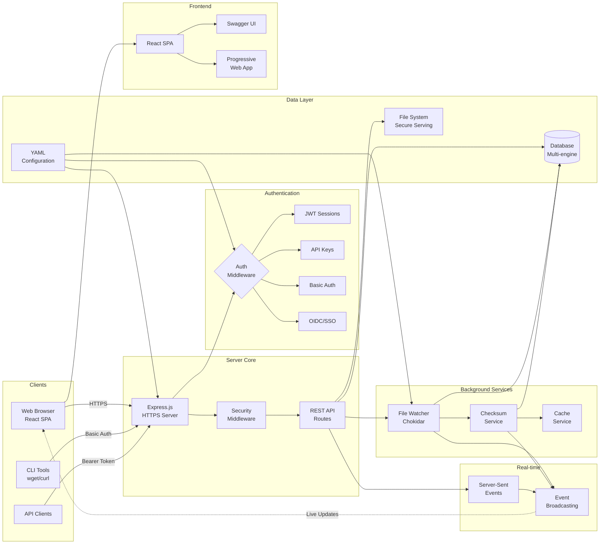

# Web-Terminal Architecture
{: .fs-8 }

Comprehensive system architecture showing all components, services, and data flows.
{: .fs-6 .fw-300 }

---

## System Overview

Web-Terminal is an enterprise-grade file management system built with a modern microservices-style architecture. The system provides secure file operations, real-time collaboration, and comprehensive API access through multiple authentication methods.

## Detailed Architecture Diagram

## Component Details

### Client Layer
- **Web Browser**: React SPA with real-time SSE integration
- **CLI Tools**: Full compatibility with wget, curl, and similar tools
- **API Clients**: RESTful API access with Bearer token authentication
- **Mobile Devices**: Responsive interface optimized for mobile access

### Authentication & Authorization
- **Multi-method Authentication**: Supports JWT sessions, API keys, and HTTP Basic Auth
- **OIDC Integration**: Enterprise SSO with Google, GitHub, and custom providers
- **Role-based Access Control**: Granular permissions (downloads, uploads, delete)
- **API Key Management**: Scoped permissions with expiration and usage tracking

### Server Core
- **Express.js**: High-performance web server with comprehensive middleware
- **Security Middleware**: Helmet, CORS, CSRF protection, and rate limiting
- **Input Validation**: Path security and upload sanitization
- **Route Handlers**: RESTful API endpoints with comprehensive error handling

### Real-time System
- **Server-Sent Events**: Live updates for file operations and progress
- **Event Broadcasting**: Multi-client synchronization system
- **WebSocket Management**: Connection handling and client state tracking

### Background Services
- **File Watcher**: Real-time file system monitoring with Chokidar
- **Checksum Service**: SHA256 calculation with worker pool management
- **Maintenance Service**: Database optimization and cleanup operations
- **Cache Service**: Performance optimization for directory listings
- **Batch Operations**: Optimized database operations for high throughput

### Data Layer
- **Multi-database Support**: SQLite (default), PostgreSQL, MySQL
- **File Metadata**: Comprehensive tracking of checksums, timestamps, and structure
- **API Key Storage**: Encrypted key storage with permission management
- **User Management**: Local and OIDC user integration

### File System
- **Secure Serving**: Path validation and access control
- **Upload Processing**: Multer integration with validation and processing
- **Static Content**: Support for custom index.html and theme assets

### Configuration & Internationalization
- **YAML Configuration**: Flexible, environment-aware configuration system
- **Multi-language Support**: Auto-detected locales with fallback support
- **Centralized Logging**: Winston-based logging with rotation and multiple transports

### Frontend Architecture
- **React SPA**: Modern single-page application with client-side routing
- **Component Library**: Comprehensive UI components for file management
- **Custom Hooks**: SSE integration and file operation abstractions
- **Progressive Web App**: Service worker support with offline capabilities
- **Integrated Swagger UI**: API documentation and testing interface

---

**[Back to Home](../)**
