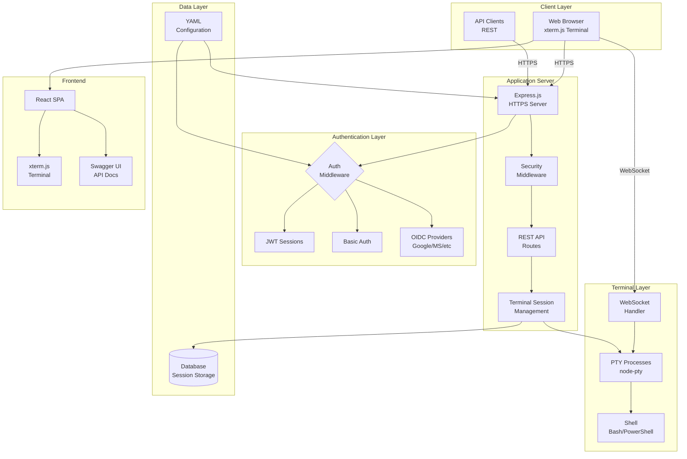

## Web-Terminal Architecture

{: .fs-8 }

Comprehensive system architecture showing all components, services, and data flows.
{: .fs-6 .fw-300 }

---

## System Overview

Web-Terminal is a secure web-based terminal application providing shell access through the browser. Built with Node.js and React, it uses WebSocket for real-time terminal I/O and supports multiple authentication methods including OIDC.

## Detailed Architecture Diagram

## Component Details

### Client Layer

- **Web Browser**: React SPA with xterm.js for terminal rendering
- **API Clients**: RESTful API access for terminal session management
- **Mobile Devices**: Responsive interface with mobile terminal support

### Authentication & Authorization

- **Multi-method Authentication**: JWT sessions, Basic Auth
- **OIDC Integration**: Enterprise SSO with Google, Microsoft, and custom providers
- **Role-based Access**: Admin vs User terminal access
- **Session Security**: JWT-based authentication with token revocation support

### Server Core

- **Express.js**: High-performance HTTPS server
- **Security Middleware**: Helmet, CORS, CSRF protection, and rate limiting
- **Route Handlers**: RESTful API for session management and authentication
- **WebSocket Upgrade**: Dedicated WebSocket handling for terminal I/O

### Terminal Layer

- **node-pty**: PTY (pseudo-terminal) process spawning
- **WebSocket Protocol**: Bidirectional real-time communication
- **Shell Support**: PowerShell on Windows, Bash on Linux/Unix
- **Session Tracking**: Active session management with health monitoring

### Session Management

- **Session Persistence**: Terminal sessions stored in database
- **Auto-cleanup**: Inactive session removal after timeout
- **Reconnection**: Sessions resume after network interruptions
- **Multi-tab Support**: Same session accessible from multiple browser tabs

### Data Layer

- **Multi-database Support**: SQLite (default), PostgreSQL, MySQL
- **Session Storage**: Terminal session metadata and state
- **User Management**: Local users and OIDC user profiles
- **Token Revocation**: JWT token tracking for backchannel logout

### Configuration & Logging

- **YAML Configuration**: Flexible, environment-aware configuration system
- **Multi-language Support**: Auto-detected locales with English and Spanish translations
- **Centralized Logging**: Winston-based logging with rotation and multiple log files
- **Separate Log Files**: Dedicated logs for app, access, auth, and database operations

### Frontend Architecture

- **React SPA**: Modern single-page application with client-side routing
- **xterm.js Integration**: Full-featured terminal emulator in the browser
- **Component Library**: UI components for terminal, authentication, and navigation
- **Progressive Web App**: Service worker support for offline functionality
- **Integrated Swagger UI**: API documentation and testing interface

---

**[Back to Home](../)**
