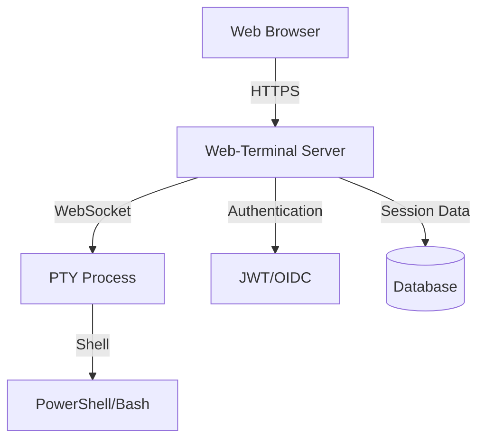

## Web-Terminal Documentation

{: .fs-9 }

A secure web-based terminal application with OIDC authentication and comprehensive API documentation.
{: .fs-6 .fw-300 }

[Get started now](#getting-started){: .btn .btn-primary .fs-5 .mb-4 .mb-md-0 .mr-2 }
[View API Reference](docs/api/swagger-ui.html){: .btn .fs-5 .mb-4 .mb-md-0 }
[View on GitHub](https://github.com/STARTcloud/web-terminal){: .btn .fs-5 .mb-4 .mb-md-0 }

---

## Getting started

**Web-Terminal** - A secure web-based terminal application providing shell access through your browser with OIDC authentication support.

### Key Features

- **Web-Based Terminal**: Access shell sessions through your browser using xterm.js
- **Comprehensive Authentication**: Basic Auth, JWT sessions, and OIDC provider support (Google, Microsoft, etc.)
- **Session Management**: Persistent terminal sessions with automatic reconnection
- **WebSocket Communication**: Real-time bidirectional terminal I/O via WebSocket
- **API Documentation**: Comprehensive Swagger UI for API endpoints
- **Multi-Platform**: DEBIAN and OmniOS packages with professional CI/CD

### Architecture

**[View Detailed Architecture](docs/architecture/)**

### Quick start

1. **Installation**: Install via DEBIAN package or build from source
2. **Configuration**: Edit `/etc/web-terminal/config.yaml` for your environment
3. **Authentication**: Configure users and OIDC providers
4. **Access Terminal**: Login via web browser and access shell
5. **Try API**: Visit the [API documentation](docs/api/swagger-ui.html) for REST API testing

### Core Capabilities

#### **Terminal Access**

- **Browser-Based Shell**: Full terminal access via xterm.js in your browser
- **Session Persistence**: Terminal sessions survive page refreshes and disconnections
- **WebSocket Communication**: Real-time bidirectional I/O between browser and shell
- **Automatic Reconnection**: Sessions automatically reconnect after network interruptions

#### **Authentication Options**

- **Basic Auth**: Simple username/password authentication
- **JWT Sessions**: Secure browser-based sessions
- **OIDC Integration**: Sign in with Google, Microsoft, or other OIDC providers

#### **API Access**

- **REST API**: Terminal session management via REST endpoints
- **Swagger UI**: Interactive API documentation and testing
- **Session Control**: Start, stop, and manage terminal sessions programmatically

### Documentation

Comprehensive documentation for all aspects of Web-Terminal:

- **[API Reference](docs/api/)** - Interactive Swagger UI documentation
- **[Getting Started Guide](docs/guides/getting-started/)** - Step-by-step setup
- **[Installation Guide](docs/guides/installation/)** - DEBIAN and OmniOS packages
- **[Authentication Guide](docs/guides/authentication/)** - User management and API keys
- **[Configuration Reference](docs/configuration/)** - Complete config options

---

## About the project

Web-Terminal is developed in &copy; 2025 by STARTcloud.

### License

Web-Terminal is distributed under a [GPL-3.0 license](https://github.com/STARTcloud/web-terminal/blob/main/LICENSE.md).

### Contributing

When contributing to this repository, please first discuss the change you wish to make via issue, email, or any other method with the owners of this repository before making a change. Read more about becoming a contributor in [our GitHub repo](https://github.com/STARTcloud/web-terminal#contributing).

#### Thank you to the contributors of Web-Terminal

<ul class="list-style-none">

  <li class="d-inline-block mr-1">
     
  </li>

</ul>

### Code of Conduct

Web-Terminal is committed to fostering a welcoming community.

[View our Code of Conduct](https://github.com/STARTcloud/web-terminal/tree/main/CODE_OF_CONDUCT.md) on our GitHub repository.
